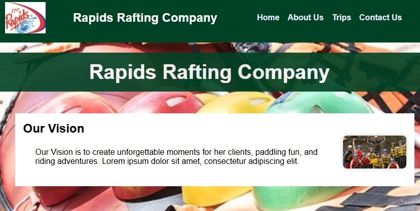

<!DOCTYPE html>
<html lang="en-US">

    <head>
        <meta charset="utf-8">
        <meta name="viewport" content="width=device-width, initial-scale=1.0">
        <title>WDD 131- Dynamic Web Fundamentals | Mirabel Nwanneka</title>
        <meta name="description" content="Mirabel Nwanneka's BYU-Idaho WDD 131 Course home page, learn more about Me and my educational journey">
        <meta name="author" content="Mirabel Nwanneka">
        <link rel="preconnect" href="https://fonts.googleapis.com">
        <link rel="preconnect" href="https://fonts.gstatic.com" crossorigin>
        <link href="https://fonts.googleapis.com/css2?family=Roboto:ital@0;1&display=swap" rel="stylesheet">
        

        <link rel="stylesheet" href="styles/base.css">
    </head>

    <body>
        <header>
            WDD 131 - Dynamic Web Fundamentals
            <nav>
                <a href="https://linkedin.com" target= "_blank">Linkedin</a>
                <a href="https://byupw.instrcture.com/" target= "_blank">Canvas</a>
                <a href="https://www.churchofjesuschrist.org/study/scriptures/ot/ex/14?lang=eng&id=p14#p14" target= "_blank">Scriptures</a>
                <a href="final-project/index.html">Final Project</a>
            </nav>
        </header>
        <main>
          <h1>Mirabel Nwanneka</h1>  

          <section class="card">
            <h2>About Me</h2>
            
            
I'm Mirabel Nwanneka, a student of BYU-Idaho, studying software development. 
            I just concluded my first certificate in medical coding from Ensign College. 
            I am married with four kids and I love to be an entrepreneur. 
            I own a small company that supplies crochet materials. 
            I am pursuing this degree to enable me to get the skills to work in the healthcare IT sector, as my own little contribution to humanity.

          </section>    
          
          <section class="card">
            <h3>My Project</h3>
            
            
Here is a project picture i have worked on in this course, homepage site, rafting website

          </section>
        </main>
    
        <footer>
           
&copy;  🍀Mirabel Angola.🍀

           

        </footer>
    </body>
</html>
